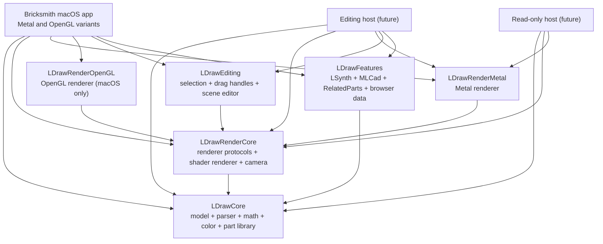

# Modularize Bricksmith for portable reuse

**Overview:** Restructure Bricksmith into six purpose-built Objective-C Swift Packages (LDrawCore, LDrawRenderCore, LDrawRenderMetal, LDrawRenderOpenGL, LDrawEditing, LDrawFeatures) so the existing macOS app keeps both Metal and OpenGL support, while other host apps can link only the subset they need with no AppKit or OpenGL bleed-through.

## Plan status

| ID | Phase | Status |
|----|-------|--------|
| `spm_skeleton` | Phase 0: create six local Swift Packages under `Packages/`, wire into `Bricksmith.xcodeproj | completed |
| `mechanical_move` | Phase 1: move pure-Foundation files into packages, fix imports, remove from app target | completed |
| `invert_gpu_dispatch` | Phase 2a: replace GPU.h macro indirection with protocol-based dispatch | completed |
| `finish_core_move` | Phase 2b: move remaining GPU-coupled model files into LDrawCore; move renderer into LDrawRenderCore | completed |
| `drop_cocoa_imports` | Phase 2c: replace `#import <Cocoa/Cocoa.h>` with Foundation in portable headers | completed |
| `texture_loader_cg` | Phase 2d: CGImageSource texture loading in LDrawUtilities | completed |
| `lsynth_protocol` | Phase 2e: LDrawLSynthConfigSource protocol and LDrawFeatures adapter | completed |
| `split_renderer` | Phase 2f: extract LDrawSceneController; rewire LDrawView | completed |
| `background_color_setter` | Phase 2g: setBackgroundColorRGBA from AppKit host views | completed |
| `feature_extractions` | Phase 2h: LDrawPartBrowserModel, LDrawToolMode, LDrawPreferences | completed |
| `resource_bundle_loading` | Phase 2i: load shaders from SPM resource bundles | completed |
| `ios_smoke_build` | Phase 2j: verify iOS builds for portable packages | completed |

## Goals (reminders)

- Bricksmith macOS app keeps the same behavior on both Metal and OpenGL renderers.
- Editing hosts reuse Bricksmith editing logic via shared modules, with no OpenGL and no AppKit.
- Read-only hosts link only the model and renderer subset (no editing logic, no feature panels).
- All extracted code stays in Objective-C.
- Each module physically excludes irrelevant code (no `#ifdef`-only separation where a real split is possible).

## Target module layout

Six local Swift Packages live under a new `Packages/` directory at the repo root. Each is a pure Objective-C SPM target with a Foundation-only public headers folder and SPM-managed platform constraints. `Bricksmith.xcodeproj` consumes them via "Add Local Package".

- **LDrawCore** (macOS + iOS) — pure Foundation model, parser, color library, part library, math.
- **LDrawRenderCore** (macOS + iOS) — GPU-agnostic renderer protocols, shared shader renderer, camera, scene visitor.
- **LDrawRenderMetal** (macOS + iOS) — Metal renderer (display lists, textures, shaders).
- **LDrawRenderOpenGL** (macOS only) — OpenGL renderer; physically cannot build for iOS.
- **LDrawEditing** (macOS + iOS) — selection, drag handles, mouse/touch hit testing, document tree, scene-edit controller extracted from `LDrawRenderer`.
- **LDrawFeatures** (macOS + iOS) — Bricksmith feature data layers reusable in an editor (LSynth, MLCad, related parts, part browser data, tool-mode enum/hotkeys, preferences schema).

The existing `Bricksmith-Metal` and `Bricksmith-OpenGL` app targets become thin macOS shells that depend on these packages and keep the AppKit-only code (widgets, NIBs, panels, inspectors, AppKit categories, drag image utilities, the AppKit-side `LDrawView` / `LDrawDocument` / `LDrawApplication` and their Metal/OpenGL categories).

### Dependency graph



## On-disk layout (SPM convention)

Each package follows SPM's Obj-C layout: public headers under `include/<Module>/`, implementation alongside.

```
Packages/
  LDrawCore/
    Package.swift
    Sources/LDrawCore/
      include/LDrawCore/        # public headers (umbrella + per-class)
        LDrawCore.h             # umbrella
        LDrawDirective.h
        LDrawFile.h
        ...
      LDrawDirective.m
      LDrawFile.m
      ...
  LDrawRenderCore/
    Package.swift
    Sources/LDrawRenderCore/
      include/LDrawRenderCore/
        LDrawRenderCore.h
        LDrawCoreRenderer.h
        LDrawShaderRenderer.h
        LDrawCamera.h
        ...
      LDrawShaderRenderer.m
      ...
  LDrawRenderMetal/
    Package.swift
    Sources/LDrawRenderMetal/
      include/LDrawRenderMetal/
        LDrawRenderMetal.h
        LDrawRendererMTL.h
        ...
      Shaders/shaders.metal     # bundled as resource
      LDrawRendererMTL.m
      ...
  LDrawRenderOpenGL/        # macOS-only via Package.swift platforms
  LDrawEditing/
  LDrawFeatures/
```

### Skeleton `Package.swift` (example for LDrawRenderMetal)

```swift
// swift-tools-version:5.9
import PackageDescription

let package = Package(
    name: "LDrawRenderMetal",
    platforms: [.macOS(.v11), .iOS(.v14)],
    products: [
        .library(name: "LDrawRenderMetal", targets: ["LDrawRenderMetal"]),
    ],
    dependencies: [
        .package(path: "../LDrawCore"),
        .package(path: "../LDrawRenderCore"),
    ],
    targets: [
        .target(
            name: "LDrawRenderMetal",
            dependencies: ["LDrawCore", "LDrawRenderCore"],
            resources: [.process("Shaders")],
            publicHeadersPath: "include",
            cSettings: [
                .define("METAL"),
                .headerSearchPath("."),
            ]
        ),
    ]
)
```

LDrawRenderOpenGL's `platforms:` declares **only** `.macOS(.v11)` — SPM will refuse to build it for iOS, providing physical isolation.

## Per-module file membership

### LDrawCore (Foundation, no AppKit, no GPU)

After the GPU-dispatch inversion (Phase 2a) lands, LDrawCore owns:

- `Bricksmith/Source/LDraw/Files/` — `LDrawFile`, `LDrawModel`, `LDrawMPDModel`, `LDrawStep`, `LDrawContainer`
- `Bricksmith/Source/LDraw/Commands/` — `LDrawColor`, `LDrawComment`, `LDrawConditionalLine`, `LDrawDrawableElement`, `LDrawLine`, `LDrawLSynth`, `LDrawLSynthDirective`, `LDrawMetaCommand`, `LDrawPart`, `LDrawQuadrilateral`, `LDrawTexture`, `LDrawTriangle`, `LPubCommand`, `LPubRemoveGroup`
- `Bricksmith/Source/LDraw/Support/` — `ColorLibrary`, `ComputationalGeometry`, `FastSet`, `LDrawDirective`, `LDrawHighResPrimitives`, `LDrawKeywords`, `LDrawMovableDirective`, `LDrawObjectWithValue`, `LDrawPathNames`, `LDrawPaths`, `LDrawUtilities`, `MatrixMath(Ex)`, `ModelManager`, `PartCatalogBuilder`, `PartLibrary`, `PartReport`, `PartSpecific`
- `Bricksmith/Source/Categories/` — `StringCategory`, `ScannerCategory`
- `Bricksmith/Source/Other/` — `RegexKitLite`, `MacLDraw.h` (constants only)
- `Bricksmith/Source/Application/Utilities/ClassInspector.{h,m}` — Foundation-only Obj-C runtime helper used by `LDrawMetaCommand` and `LPubCommand`.

Cleanups required to compile against `<Foundation/Foundation.h>` alone:

- Replace `#import <Cocoa/Cocoa.h>` with `<Foundation/Foundation.h>` in `LDrawTexture.h` (line 10).
- Refactor [`LDrawUtilities.m`](Bricksmith/Source/LDraw/Support/LDrawUtilities.m) lines 617–619 (currently `[[NSImage alloc] initWithContentsOfFile:]` + `CGImageForProposedRect:`) to load a `CGImageRef` via `CGImageSourceCreateWithURL`. The GPU-side `PartLibraryMTL` / `PartLibraryGL` already consume `CGImageRef`.
- In [`LDrawLSynth.m`](Bricksmith/Source/LDraw/Commands/LDrawLSynth.m) lines 17, 22–24, 1300, 1309: drop `#import "LDrawApplication.h"`, `#import "PreferencesDialogController.h"`, `#import "UserDefaultsCategory.h"`. Inject an `LDrawLSynthConfigSource` protocol (provides `lsynthConfiguration` and selection-tint RGBA) instead of pulling `[LDrawApplication shared].lsynthConfiguration` and `[NSUserDefaults colorForKey:]`. Bricksmith and other hosts each supply an implementation.
- In [`ComputationalGeometry.m`](Bricksmith/Source/LDraw/Support/ComputationalGeometry.m) line 22: remove `#import "LSynthConfiguration.h"` by routing the only call site through the new protocol or moving the LSynth-specific helper to LDrawFeatures.
- Move the existing `Source/Other/GPU.h` macro indirection out of LDrawCore — see Phase 2a (the model code stops importing renderer headers).

### LDrawRenderCore (GPU-agnostic renderer)

- `Bricksmith/Source/LDraw/Renderer/LDrawBDPAllocator.{h,m}`
- `Bricksmith/Source/LDraw/Renderer/LDrawCoreRenderer.h`
- `Bricksmith/Source/LDraw/Renderer/LDrawShaderRenderer.{h,m}`
- `Bricksmith/Source/LDraw/Renderer/MeshSmooth.{c,h}`
- `Bricksmith/Source/LDraw/Support/LDrawCamera.{h,m}` — flip `#import <Cocoa/Cocoa.h>` to `<Foundation/Foundation.h>`; keep `CGFloat` (works on both platforms).
- The rendering-only portion of `Bricksmith/Source/LDraw/Support/LDrawRenderer.{h,m}` (see "Split LDrawRenderer" below) — the visit/draw/camera-wiring half.
- New `LDrawDirective+Drawing.h` and `LDrawPartLibrary+GPU.h` protocol declarations (replacing the today's `LDrawDirectiveGPU_h` / `PartLibraryGPU_h` include-time macros). See Phase 2a.

Cleanups:

- Replace `NSSize` with `CGSize` in `LDrawRenderer.h` line 77 (`initWithBounds:`).

### LDrawRenderMetal (Metal renderer, portable)

Everything that today lives under `Bricksmith/Metal/` **except** the AppKit categories `LDrawApplicationMTL`, `LDrawDocumentMTL`, `LDrawViewMTL` (those stay in BricksmithMac):

- `Bricksmith/Metal/Global/MetalGPU.{h,m}`, `MetalCommonDefinitions.h`
- `Bricksmith/Metal/LDraw/Commands/LDrawTextureMTL.{h,m}`
- `Bricksmith/Metal/LDraw/Renderer/LDrawDisplayListMTL.{h,m}`, `LDrawShaderRendererMTL.{h,m}`
- `Bricksmith/Metal/LDraw/Support/LDrawDirectiveMTL.{h,m}`, `LDrawRendererMTL.{h,m}`, `MetalUtilities.{h,m}`, `PartLibraryMTL.{h,m}`, `SIMDConversions.h`
- `Bricksmith/Metal/Shaders/shaders.metal` — declared in `Package.swift` as `.process("Shaders")` so it ships in the package resource bundle.
- `Bricksmith/Metal/MTL.h` — slimmed down once the `LDrawDirectiveGPU_h` / `PartLibraryGPU_h` macros are gone (Phase 2a). The remaining content is just the `@import MetalKit;` shim.

This package provides categories on `LDrawDirective`, `LDrawPart`, `LDrawTexture`, etc. that implement the `LDrawDirectiveDrawing` and `LDrawPartLibraryGPU` protocols declared in LDrawRenderCore. The app target links with `OTHER_LDFLAGS = -ObjC` to keep cross-package categories.

Cleanups:

- `LDrawRendererMTL.m` lines 271 and 327: replace `NSSize` / `NSColor.controlBackgroundColor` with `CGSize` and an explicit RGBA setter on the renderer.
- Switch shader loading from `[NSBundle mainBundle]` to the package resource bundle (`SWIFTPM_MODULE_BUNDLE` macro pattern documented in Risks below).
- `MTL.h` retains only the Metal `@import` and any genuinely cross-cutting Metal typedefs; the `GPUView`/`PartLibraryGPU`/`LDrawTextureGPU` macros are dropped because callers no longer go through them.

### LDrawRenderOpenGL (macOS only)

Everything under `Bricksmith/OpenGL/` minus the AppKit categories `LDrawApplicationGL`, `LDrawDocumentGL`, `LDrawViewGL` (kept in BricksmithMac).

- `Bricksmith/OpenGL/LDraw/Commands/LDrawTextureGL.{h,m}`
- `Bricksmith/OpenGL/LDraw/Renderer/LDrawDisplayListGL.{h,m}`, `LDrawShaderRendererGL.{h,m}`, `LDrawShaderLoader.{h,m}`
- `Bricksmith/OpenGL/LDraw/Support/LDrawDirectiveGL.{h,m}`, `LDrawRendererGL.{h,m}`, `OpenGLUtilities.{c,h}`, `PartLibraryGL.{h,m}`
- `Bricksmith/OpenGL/Shaders/test.glsl`
- `Bricksmith/OpenGL/GL.h` — slimmed down (same reasoning as `MTL.h`).

The package declares `platforms: [.macOS(.v11)]` only; SPM rejects iOS builds, so non-macOS hosts physically cannot link it.

### LDrawEditing (editor model, no AppKit)

- `Bricksmith/Source/LDraw/Support/LDrawDragHandle.{h,m}`
- `Bricksmith/Source/LDraw/Support/LDrawDocumentTree.{h,m}`
- New `LDrawSceneController.{h,m}` extracted from `LDrawRenderer.m` containing: selection state, marquee selection, drag-handle hit testing, mouse-down/dragged/up logic, hover-over-point, `mouseDown`/`mouseDragged` (currently around `LDrawRenderer.m` lines 769–832+). The host (AppKit `LDrawView` or a UIKit equivalent) forwards normalized 2D/3D events to this controller.

Cleanups:

- `NSTimer` ivar at `LDrawRenderer.m:54` (drag-and-drop countdown) moves to the host UI layer (`LDrawView` on macOS, a UIKit gesture recognizer elsewhere). The scene controller offers `beginDragHandleAt:`/`updateDragHandleAt:`/`endDragHandle` style APIs and is timer-free.

### LDrawFeatures (Bricksmith feature data layers)

Reusable in Bricksmith and other editing hosts; omitted by read-only hosts.

- `Bricksmith/Source/Application/General/LSynthConfiguration.{h,m}` — already Foundation-only header; supplies the `LDrawLSynthConfigSource` protocol implementation for LDrawCore.
- `Bricksmith/Source/Application/General/RelatedParts.{h,m}` — already Foundation-only logic; replace `#import <Cocoa/Cocoa.h>` with Foundation.
- `Bricksmith/Source/Other/MLCadIni.{h,m}` — minifigure generator + LSynth visible types config parser; flip header to Foundation.
- New `LDrawPartBrowserModel.{h,m}` extracted from [`PartBrowserDataSource.m`](Bricksmith/Source/Application/General/PartBrowserDataSource.m) `filterPartRecords:bySearchString:excludeParts:` (line 811), category/search state, `indexOfPartNamed:`. The AppKit `PartBrowserDataSource` stays in BricksmithMac and delegates to this.
- New `LDrawToolMode.{h,m}` extracted from [`ToolPalette.m`](Bricksmith/Source/Application/General/ToolPalette.m): the `ToolModeT` enum, `keysForToolMode:`, `toolMode:matchesCharacters:`. The AppKit `NSPanel`-based `ToolPalette` stays in BricksmithMac.
- New `LDrawPreferences.{h,m}` extracted from [`PreferencesDialogController.m`](Bricksmith/Source/Application/General/PreferencesDialogController.m): `ensureDefaults`, key constants, getters/setters around `NSUserDefaults` (available on iOS). The window UI stays in BricksmithMac.

### BricksmithMac (existing macOS app, two products)

Stays as today's two app targets `Bricksmith-Metal` and `Bricksmith-OpenGL` and keeps everything that is genuinely AppKit:

- `Bricksmith/Source/Widgets/*` (all of it — `LDrawView`, `LDrawViewerContainer`, `ViewportArranger`, `OverlayHelper*`, `Extended*`, `LDrawColor*`, etc.)
- `Bricksmith/Source/Application/Document/*` (`LDrawDocument`, panels, toolbar)
- `Bricksmith/Source/Application/General/*` (the controllers and panels; LSynth/MLCad/RelatedParts moved out)
- `Bricksmith/Source/Application/Inspector/*` (all of it)
- `Bricksmith/Source/Categories/` — `BezierPathCategory`, `OverlayViewCategory`, `TableViewCategory`, `UserDefaultsCategory`, `WindowCategory`
- `Bricksmith/Source/Other/` — `BricksmithUtilities`, `StringUtilities`, `TransformerIntMinus1`, `main.m`, `Mac LDraw_Prefix.pch`
- Metal/OpenGL AppKit categories: `Metal/Application/Document/LDrawDocumentMTL`, `Metal/Application/General/LDrawApplicationMTL`, `Metal/Widgets/LDrawViewMTL` (Metal target); same set under `OpenGL/Application/...` and `OpenGL/Widgets/LDrawViewGL` (OpenGL target).
- Resources (xibs, images, Localizable, Sparkle, AMSProgressBar embed).

The `LDrawRenderer` editor halves are deleted/replaced by calls into `LDrawSceneController` (LDrawEditing).

## Execution phases

### Phase 0 — Skeleton (no behavior change)

1. Create `Packages/<Module>/Package.swift` and `Sources/<Module>/include/<Module>/` for the six modules. Empty umbrella headers (`LDrawCore.h`, etc.) and one trivial placeholder `.m` per module so SPM accepts them.
2. Declare platforms: `[.macOS(.v11), .iOS(.v14)]` for five modules; `[.macOS(.v11)]` only for LDrawRenderOpenGL.
3. Declare inter-package dependencies per the graph above (LDrawRenderCore depends on LDrawCore, etc.).
4. In `Bricksmith.xcodeproj`, add the six packages as Local Package references. Add each to the appropriate app target's "Frameworks, Libraries, and Embedded Content" (Metal target gets LDrawRenderMetal; OpenGL target gets LDrawRenderOpenGL; both get the other four).
5. Add `OTHER_LDFLAGS = -ObjC` to both app targets so categories defined in packages aren't dead-stripped.
6. Verify both `Bricksmith-Metal` and `Bricksmith-OpenGL` still build and run unchanged (sources still in-app).

### Phase 1 — Move the pure-Foundation, no-GPU files

Move every file from the per-module lists above that does **not** `#import LDrawDirectiveGPU_h`, `PartLibraryGPU_h`, or `LDrawTextureGPU_h`. Concretely, what moves now:

- LDrawCore: most of `Source/LDraw/Commands/*` (except `LDrawTexture`, `LDrawPart`), most of `Source/LDraw/Support/*` (except `LDrawUtilities`, `PartReport`, `LDrawRenderer`), `Source/LDraw/Files/LDrawContainer`, `Source/LDraw/Files/LDrawMPDModel`, `Source/Categories/{String,Scanner}`, `Source/Other/RegexKitLite`, `Source/Application/Utilities/ClassInspector`.
- LDrawRenderCore: `Source/LDraw/Renderer/{LDrawBDPAllocator, LDrawCoreRenderer, LDrawShaderRenderer, MeshSmooth}`, `Source/LDraw/Support/LDrawCamera`.
- LDrawRenderMetal: all of `Bricksmith/Metal/` except the AppKit categories (`LDrawApplicationMTL`, `LDrawDocumentMTL`, `LDrawViewMTL`).
- LDrawRenderOpenGL: all of `Bricksmith/OpenGL/` except the AppKit categories.
- LDrawEditing: `Source/LDraw/Support/{LDrawDragHandle, LDrawDocumentTree}`.
- LDrawFeatures: `Source/Application/General/{LSynthConfiguration, RelatedParts}`, `Source/Other/MLCadIni`.

For each moved file, update `#import "X.h"` to `#import <ModuleName/X.h>` and remove the file from the app target. The remaining GPU-coupled model files (`LDrawPart`, `LDrawTexture`, `LDrawFile`, `LDrawModel`, `LDrawStep`, `LDrawUtilities`, `PartReport`, `LDrawRenderer`) stay in the app target temporarily — they still `#import LDrawDirectiveGPU_h`, which would create a circular dependency through SPM if moved now.

Sanity checkpoints at end of Phase 1:

- `Bricksmith-Metal` and `Bricksmith-OpenGL` compile, link, and pass `UnitTests`.
- Each package builds in isolation via `cd Packages/<Module> && swift build`.

### Phase 2 — Cleanups required for portable hosts

#### 2a. Invert GPU dispatch (prerequisite for finishing LDrawCore)

The current design has model `.m` files `#import LDrawDirectiveGPU_h` (a macro from `Source/Other/GPU.h`), which expands to a renderer-specific header (`LDrawDirectiveMTL.h` or `LDrawDirectiveGL.h`). This couples model code to a single renderer at compile time and makes it impossible to put the model in a package that is shared by **both** renderers.

Replace with protocol-based dispatch:

- In LDrawRenderCore declare:
  - `@protocol LDrawDirectiveDrawing <NSObject> - (void) drawSelf:(id<LDrawRenderer>)renderer; @end`
  - `@protocol LDrawPartLibraryGPU - (void) loadImageDisplayList:(LDrawTexture *)tex; ...; @end`
- LDrawRenderMetal provides `LDrawDirective (Metal)`, `LDrawPart (Metal)`, `LDrawTexture (Metal)`, `PartLibrary (Metal)` categories that implement these protocols.
- LDrawRenderOpenGL does the same with `(OpenGL)` categories.
- Model `.m` files (e.g. `LDrawStep.m:34`, `LDrawModel.m:24`, `LDrawFile.m:22`, `LDrawPart.m:37`, `LDrawTexture.m:16`, `LDrawUtilities.m:27–28`, `PartReport.m:31`) drop their `#import LDrawDirectiveGPU_h` / `PartLibraryGPU_h` / `LDrawTextureGPU_h` lines and call protocol methods on the directives directly.
- `Source/Other/GPU.h`, `Metal/MTL.h`, `OpenGL/GL.h` lose their `LDrawDirectiveGPU_h` / `PartLibraryGPU_h` / `LDrawTextureGPU_h` / `LDrawShaderRendererGPU_h` macros. What remains is just `@import MetalKit;` (in MTL.h) and OpenGL framework imports (in GL.h).

#### 2b. Finish moving LDrawCore

Now that the model code is GPU-agnostic, move into LDrawCore: `LDrawPart`, `LDrawTexture`, `LDrawFile`, `LDrawModel`, `LDrawStep`, `LDrawUtilities`, `PartLibrary`, `PartCatalogBuilder`, `PartReport`. Move `LDrawRenderer` (rendering half — see 2f below) into LDrawRenderCore.

#### 2c. Drop unnecessary Cocoa imports

Replace `#import <Cocoa/Cocoa.h>` with `<Foundation/Foundation.h>` in:

- `LDrawCamera.h`, `LDrawTexture.h`, `LDrawBDPAllocator.h`, `LDrawCoreRenderer.h`, `LDrawShaderRenderer.h`
- `Source/Other/StringUtilities.h`, `Source/Other/MLCadIni.h`
- `Source/Application/General/RelatedParts.h`
- `Metal/LDraw/Renderer/LDrawDisplayListMTL.h`, `Metal/Global/MetalGPU.h`, `Metal/LDraw/Support/MetalUtilities.h`
- `OpenGL/LDraw/Renderer/LDrawDisplayListGL.h`, `OpenGL/LDraw/Renderer/LDrawShaderLoader.h`, `OpenGL/LDraw/Commands/LDrawTextureGL.h`

#### 2d. Texture loading via CGImage

Rewrite the texture loader in `LDrawUtilities.m` (lines 617–619) to use `CGImageSourceCreateWithURL` → `CGImageRef`. Verify both `PartLibraryMTL.m` and `PartLibraryGL.m` consume the new entry point (they already work with `CGImageRef`).

#### 2e. LSynth config injection

- Declare `@protocol LDrawLSynthConfigSource` in LDrawCore exposing `lsynthConfiguration` and `selectionTintRGBA`.
- Adapter implementation lives in LDrawFeatures (`LSynthConfiguration` + a small `LDrawLSynthConfigBridge`); Bricksmith macOS app installs it at startup via a setter on a small `+LDrawLSynth.configSource` singleton.
- Replace `[NSUserDefaults … colorForKey:]` reads at `LDrawLSynth.m:1300, 1309` with four `NSNumber` keys or one `NSData` blob storing float RGBA, so `UserDefaultsCategory` (AppKit `NSColor`) is no longer needed.

#### 2f. Split `LDrawRenderer` editor half

Extract editor code into a new `LDrawSceneController` class in LDrawEditing. Touch points:

- `LDrawRenderer.m:54` — `NSTimer` ivar (drag-and-drop countdown)
- `LDrawRenderer.m:769–832+` — `mouseDown`, `mouseDragged`, marquee selection, drag-handle hit testing, hover-over-point

`LDrawView.m` (in BricksmithMac) is rewired to forward normalized events to the scene controller; a UIKit host view would do the same via gesture recognizers.

#### 2g. Background color setter

Remove `NSColor.controlBackgroundColor` reads in `LDrawRendererMTL.m:327` and `LDrawRendererGL.m:72–73`. Expose `setBackgroundColorRGBA:(float[4])rgba` on the renderer; `LDrawViewMTL.m` / `LDrawViewGL.m` (still in BricksmithMac, still AppKit) call it.

#### 2h. Feature extractions

Extract `LDrawPartBrowserModel`, `LDrawToolMode`, `LDrawPreferences` from their AppKit hosts as described in the per-module section. The AppKit hosts delegate into them.

#### 2i. Resource bundle loading

`shaders.metal` is declared `resources: [.process("Shaders")]` in `Packages/LDrawRenderMetal/Package.swift`. Obj-C consumers must load via the package resource bundle, not `[NSBundle mainBundle]`. Pattern:

```objc
// In LDrawRenderMetal source files:
#ifndef SWIFTPM_MODULE_BUNDLE
#define SWIFTPM_MODULE_BUNDLE [NSBundle bundleForClass:[LDrawShaderRendererMTL class]]
#endif
NSURL *shaderURL = [SWIFTPM_MODULE_BUNDLE URLForResource:@"shaders" withExtension:@"metallib"];
```

SPM automatically defines `SWIFTPM_MODULE_BUNDLE` for Swift targets; for Obj-C targets we either rely on the auto-generated `<Module>_<Target>.bundle` lookup or fall back to `bundleForClass:`. Update `LDrawApplicationMTL.m` and any other current consumer of `[NSBundle mainBundle]` for shaders.

#### 2j. iOS smoke build

Verify with `xcodebuild -scheme LDrawCore -destination 'generic/platform=iOS Simulator' build` (and the same for `LDrawRenderCore`, `LDrawRenderMetal`, `LDrawEditing`, `LDrawFeatures`). Bricksmith-Metal and Bricksmith-OpenGL still build and tests pass on macOS.

## Risks and mitigations

- **GPU.h include-time indirection couples model to a single renderer.** SPM cannot express this; both renderers must coexist in a single Bricksmith binary. **Mitigation:** Phase 2a inverts the dispatch to protocol-based, breaking the macro indirection entirely. This is the largest source change in the plan and is a hard prerequisite for finishing LDrawCore (Phase 2b).
- **PCH-induced hidden AppKit dependencies.** `Source/Other/Mac LDraw_Prefix.pch` imports Cocoa for every translation unit, so today's "Foundation-only" headers may secretly rely on AppKit symbols. **Mitigation:** packages do not declare a PCH; the first iOS build will surface every leak.
- **Cross-package Obj-C categories.** Categories on classes defined in another package are valid SPM but require `OTHER_LDFLAGS = -ObjC` on the consuming app target so the linker keeps them. Set on both `Bricksmith-Metal` and `Bricksmith-OpenGL` in Phase 0.
- **Resource bundles for shaders.** `shaders.metal` shipped via `.process(...)` lives in a per-target resource bundle, not the app bundle. **Mitigation:** use `[NSBundle bundleForClass:[LDrawShaderRendererMTL class]]` (which on SPM Obj-C targets resolves to the package resource bundle) or the `SWIFTPM_MODULE_BUNDLE` pattern. Verified in Phase 2i.
- **Inter-package header import style.** SPM Obj-C consumers must use `#import <Module/Header.h>`, not `#import "Header.h"`, when crossing package boundaries. **Mitigation:** mechanical sed-free edit during the Phase 1 move; each file's includes get reviewed before retargeting.
- **`LDrawRenderer` is hybrid.** It mixes rendering with selection/edit. Splitting it (Phase 2f) is the largest semantic change. **Mitigation:** keep `LDrawRenderer` as the rendering-side façade in LDrawRenderCore; have `LDrawSceneController` in LDrawEditing hold the editor state and consume read-only camera + viewport state from `LDrawRenderer`.
- **`MTL.h` / `GL.h` were doing two jobs.** They declared the GPU framework import **and** macro indirection for header redirection. After Phase 2a, they shrink to just the framework import. **Mitigation:** delete the indirection macros once no consumer references them; remaining headers stay in their respective packages.
- **Build-time order with two packages requiring `LDrawCore`.** SPM resolves the DAG automatically; no manual ordering needed. But the two renderer packages must not link each other (LDrawRenderMetal must never reference OpenGL types and vice versa). The platform constraint on LDrawRenderOpenGL enforces this for iOS; macOS still requires discipline.
- **NSDocument-based undo manager** lives only in BricksmithMac. Other editing hosts must supply their own undo stack; not in scope here, but the editing primitives are exposed via LDrawEditing's scene controller.

## What this plan deliberately does not do

- Does not create additional host apps. It produces the modules they will link.
- Does not change rendering output, file format support, or any user-visible behavior.
- Does not convert any code to Swift.
- Does not migrate `AMSProgressBar` or `Sparkle` — they remain consumed by `Bricksmith.xcodeproj` as today.

## Alternatives considered (call out if you want one instead)

- **Xcode framework / static library targets inside `Bricksmith.xcodeproj`.** Same module boundaries; avoids SPM's stricter cross-package header visibility and resource-bundle gotchas; categories across targets work via `-ObjC` the same way. This was the original plan; switch back if SPM friction becomes painful.
- **Separate `.xcodeproj` per module embedded in `Bricksmith.xcworkspace`.** Mirrors the existing `AMSProgressBar.xcodeproj` pattern. Useful if modules will be developed in isolation but heavier than SPM.
- **Folder reorganization only, no new build targets.** Simplest but does not enforce "no OpenGL in portable hosts" — those targets would have to cherry-pick files manually.
- **Conservative `#if TARGET_OS_OSX` guards only, no split of `LDrawRenderer`, no GPU dispatch inversion.** Faster to land but leaves editor code shipped in read-only binaries and AppKit declarations visible to non-macOS code; LDrawCore cannot be a real shared package while it still imports renderer headers.
