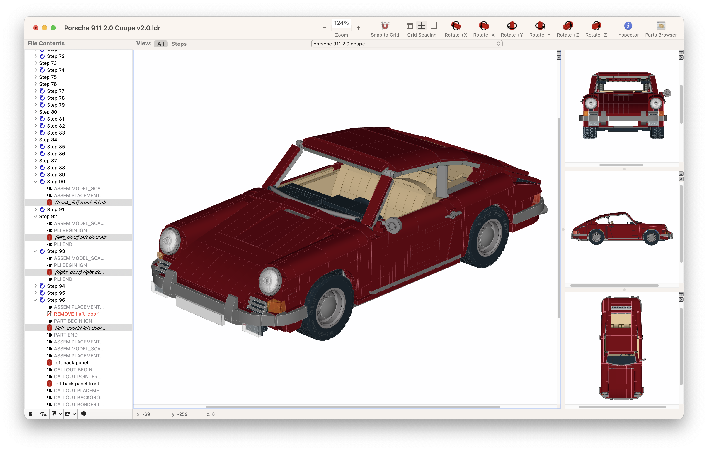

# Bricksmith-M

A modernized and enhanced [LDraw](https://www.ldraw.org/) editor for creating and editing LEGO digital models on macOS. This is an advanced fork that brings big improvements to the original Bricksmith application, featuring modern rendering technology and enhanced workflow process.

## Overview

Bricksmith-M is a powerful CAD application designed specifically for LEGO enthusiasts and builders. This enhanced version provides an intuitive interface for creating detailed LEGO models using the LDraw standard format, with support for complex multi-step building instructions and advanced rendering features. Key improvements include Metal-powered graphics rendering, ARC memory management, enhanced workflow tools, and better integration with modern LEGO building communities.

I am deeply grateful to [bsupnik](https://github.com/bsupnik) and [Allen Smith](https://github.com/allenmonroesmith) for their well-crafted work in creating an excellent application for LDraw editing. They have made digital LEGO building easy to use and enjoyable. In 2021, they updated Bricksmith to work with newer Xcode versions and modern macOS systems. You can find the current official Bricksmith version at: [bsupnik/bricksmith](https://github.com/bsupnik/bricksmith).

## System Requirements

- macOS 10.15 or later (for Metal-powered version)
- macOS 10.14 or later (for OpenGL version)
- Graphics card with Metal support (for advanced rendering features)

## Key Features

### Core Functionality
- **Multi-format Support**: Native support for LDraw (.ldr), DAT (.dat), and Multi-Part Document (.mpd) files
- **Step-by-Step Instructions**: Create detailed building instructions with multiple steps
- **Part Library Integration**: Seamless access to the complete LDraw parts database
- **3D Visualization**: Real-time 3D preview of your models

## Enhanced Capabilities

### Graphics & Rendering Enhancements
- **ARC Memory Management**: Automatic Reference Counting for improved memory efficiency and stability
- **Metal-Powered Rendering**: Hardware-accelerated graphics using Apple's Metal framework for superior performance and visual quality

### Workflow & Interface Improvements
- **MLCAD Compatibility**: Support for MLCAD 'group' structures and commands
- **Enhanced Rotation Controls**:
  - "Axes by Part Rotation" command for precise orientation control
  - "Origin by rotation center" command for better pivot point management
  - Quick rotation modifications for rapid adjustments
  - Automatic step rotation application when using absolute rotation mode
- **Precision Movement**:
  - Slow movement mode activated with Command key for fine adjustments
  - Symmetrical part movement along X-axis for balanced designs
- **Smart Step Management**:
  - Improved "Split step" behavior - new step is created before the current step
  - Intelligent positioning for all insertions (new content appears after the currently selected item)
  - Tree view navigation in step mode automatically updates the current step
- **User Experience Enhancements**:
  - "Move to Parent Model" command for hierarchical organization
  - Automatic detection and selection of missing parts when opening models
  - Enhanced parts export format with Rebrickable compatibility

## Installation

1. Download the latest release from the releases page or build from these sources
2. If downloaded: Mount the disk image and drag Bricksmith-M to your Applications folder
3. Launch the application and follow the setup wizard to download the LDraw parts library

## Getting Started

1. **Create a New Model**: Use File → New to start a fresh model
2. **Add Parts**: Browse the parts library and drag components into your model
3. **Build Steps**: Use the step management tools to create building instructions
4. **Customize View**: Adjust rendering settings and viewing angles for optimal visualization
5. **Export**: Save your work in LDraw format or export for sharing

## File Format Support

- **.ldr** - LDraw model files
- **.dat** - LDraw part definition files  
- **.mpd** - Multi-Part Document files for complex models with submodels

## License

This project builds upon the original Bricksmith application. Please refer to the license file for detailed terms and conditions.

## Acknowledgments

- Original Bricksmith application and its contributors
- The LDraw.org community for the parts library and file format standards
- Apple for the Metal framework that enables our advanced rendering capabilities
- The LEGO community for inspiration and feedback

## Support

For questions, bug reports, or feature requests, please use the Issues section of this repository. For general LDraw and LEGO building questions, consider visiting the LDraw.org forums.
